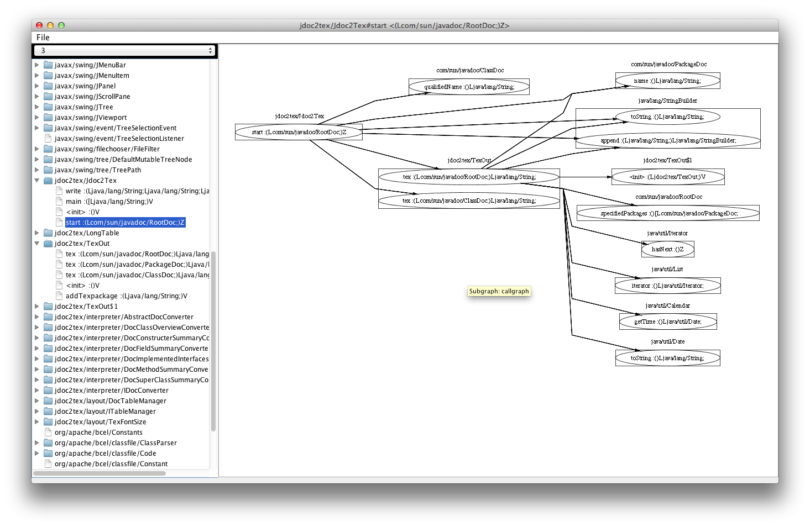

bcg
===
コールグラフを、swingを使って図にして表示するなにか

準備するもの
--
bcel (v6推奨)  
Graphviz (dot、twopiコマンドが使える事)  
Grappa

コンパイル
--
build.xmlのあるディレクトリでantコマンドを実行して下さい。

```
ant

``` 
※内部でbcelと、GraphvizのGrappa関連の機能を使うので，それぞれのjarファイルをlibにコピる必要があります。


使い方
--
普通にantにrunタスクがあります。
コンパイルが通ればそのまま実行できます。

```
ant run
```

スクリーンショット
--


らいせんす  
MIT
